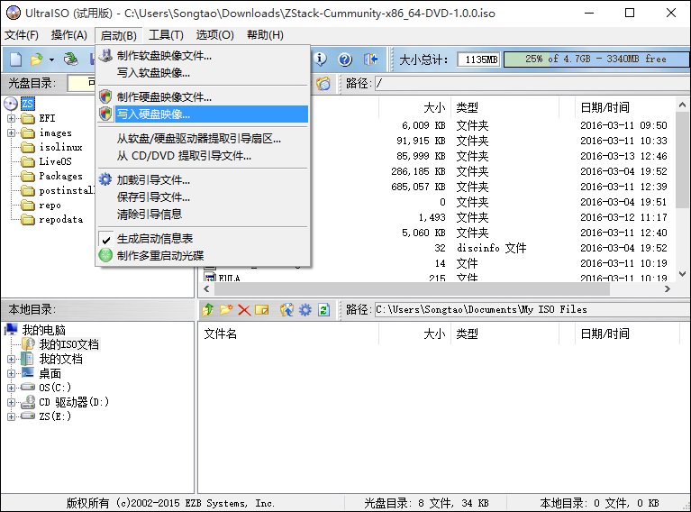
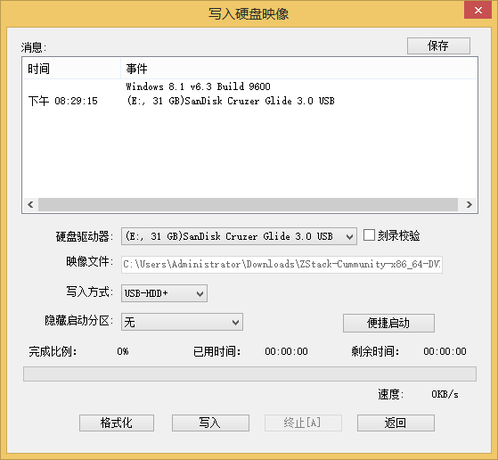
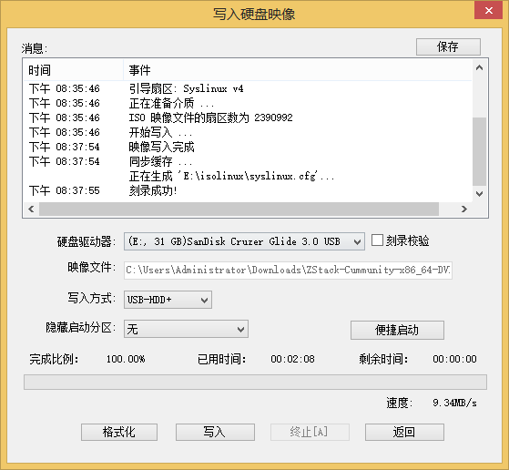
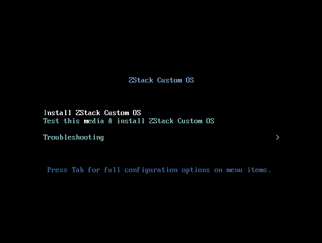
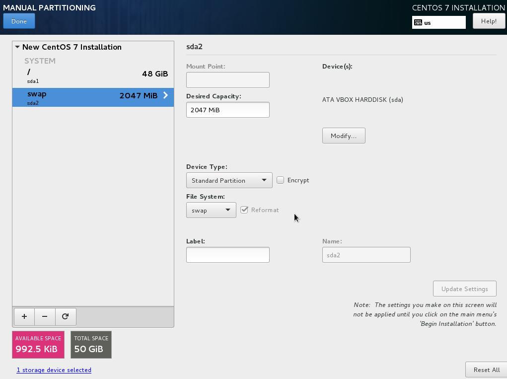
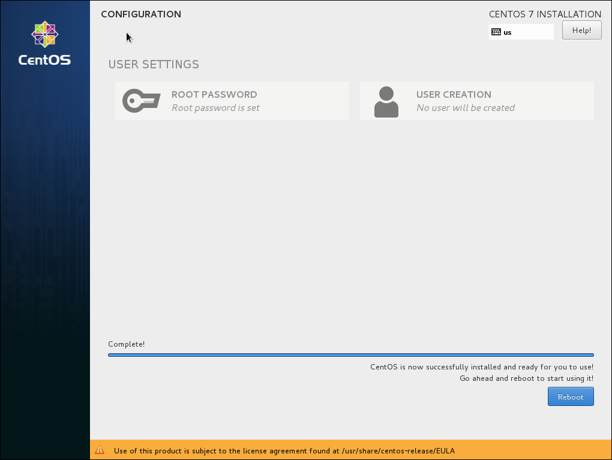
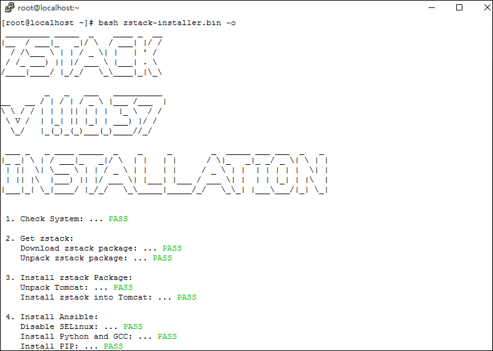

## ZStack离线安装教程
针对无法访问互联网以及访问互联网速度较慢的用户，ZStack 1.1版本特别提供了一个离线安装的方法。
用户使用离线安装方法，首先需要在管理节点,镜像服务器和计算节点上安装CentOS 7.2的ZStack社区版，
然后在安装ZStack的时候使用-o参数即可快速完成环境的搭建。

本文将会详细介绍如何把定制版ISO的刻录成U盘，如何使用U盘引导安装CentOS 7.2操作系统，
以及如何离线安装ZStack系统的方法。

#### CentOS 7.2 ZStack社区版ISO特性：
1.	基于CentOS-7-x86_64-Minimal-1511.ISO深度定制；
2.	包含ZStack需要的所有安装包，安装ZStack时，无须连接外网，也无须配置yum源，就可以实现ZStack的完全离线安装；
3.	保留了CentOS7.2的官方yum源，支持官方yum更新；
4.	默认设置了root密码为password，支持安装OS后修改密码；
5.	网卡名称默认为ethX格式，例如eth0或eth1；
6.	默认选项：时区--亚洲东八区，语言--English，键盘--English(United States)。

### CentOS 7.2 ZStack 社区定制版系统安装教程：

#### 1.	下载ZStack社区定制版CentOS7.2 ISO
文件名称：ZStack-Cummunity-x86_64-DVD-1.0.0.iso 

MD5校验码：55641ea8ba4e0a10eb7429d8dd46e33b 

下载地址1：
http://download.zstack.org/ISO/ZStack-Cummunity-x86_64-DVD-1.0.0.iso

下载地址2：
http://pan.baidu.com/s/1i4IccN7

#### 2. 制作U盘安装盘

##### 2.1	使用UltraISO打开ISO 
使用UltraISO，点击“文件”按钮，选择打开已下载好的CentOS7.2 ISO文件，如图1所示。


*图1 选择UltraISO打开定制版CentOS7.2 ISO*

##### 2.2	写入硬盘镜像
点击“启动”按钮，选择“写入硬盘镜像”，如图2所示。



*图2 点击写入硬盘镜像*
 
##### 2.3	将ISO写入硬盘镜像
在硬盘驱动器列表选择相应的U盘进行刻录，如果系统只插了一个U盘，则默认以此U盘进行刻录和写入，在刻录前，注意备份U盘之前的内容。
其他选项，按照默认设置，无须额外配置。点击“写入”按钮，如图3所示。在新界面中点击“是”按钮进行确认，UltraISO将会把此ISO刻录到U盘。
 


*图3 选择U盘，点击写入按钮* 


*图4 确认写入*

##### 2.4	刻录检查
刻录成功的界面如图5所示，表示ZStack的定制版CentOS 7.2 可引导U盘已刻录成功。 



*图5 刻录检查*

#### 3.	使用U盘引导CentOS7.2
此ISO支持Legacy模式引导，也支持UEFI模式引导。可根据需求，自定义选择安装。下面以Legacy模式引导安装举例。
在BIOS启动选项列表，选择此U盘为第一启动设备，启动后，引导安装界面如图6所示：



*图6 可引导U盘启动界面*

#### 4.	硬盘分区
安装过程中，只需进行分区，即可一键安装CentOS7.2操作系统，如图7所示的分区为根分区48G，swap分区为2G。也可根据存储及需求，提前设置好大容量分区。



*图7 安装分区界面*

#### 5.	安装系统
分区完毕后，点击“Begin Installation”按钮，开始安装。如图8所示。


*图8 点击Begin Installation按钮*
 
所有的安装包安装完毕后，点击“reboot”按钮，如图9所示，即可启动进入CentOS7.2系统。



*图9 点击reboot按钮*
 

### 离线安装ZStack：
安装系统后，可通过以下方法离线安装ZStack。

1.	下载ZStack离线安装包到任意目录(假定文件名为zstack-installer.bin)；
2.	在此目录下执行“bash zstack-installer.bin -o”即可完成相应安装。如图10所示。
3.	安装过程如果提示错误，可参考相应错误提示进行处理。如果无法正常安装可发送相应错误日志到官方讨论群寻求帮助。
4.	安装完毕可参考相应的提示，访问对应的URL打开ZStack Web UI。


*图10 离线安装ZStack*

## 配置用户内网独立yum源：

如果用户自己在内部配置了统一的yum源,也可以不使用ZStack CentOS 7.2 社区版的ISO来安装系统。
但是需要手动在每一台机器上(需要安装ZStack管理节点,镜像服务器以及计算节点的机器),编写如下的yum配置,把内部yum源配置到名为zstack-local的repository里:

```
#echo /etc/yum.repos.d/zstack-local.repo
[zstack-local]
name=ZStack Local Yum Repo
baseurl=http://内部YUM源URL
enabled=0
gpgcheck=0
```

需要注意的是该内部源内需要包含系统需要以来的各种标准库,包括epel里的库.

配置之后,就可以使用-o参数来安装ZStack.添加各种ZStack资源的时候,也会使用每台服务器上的该配置文件.
