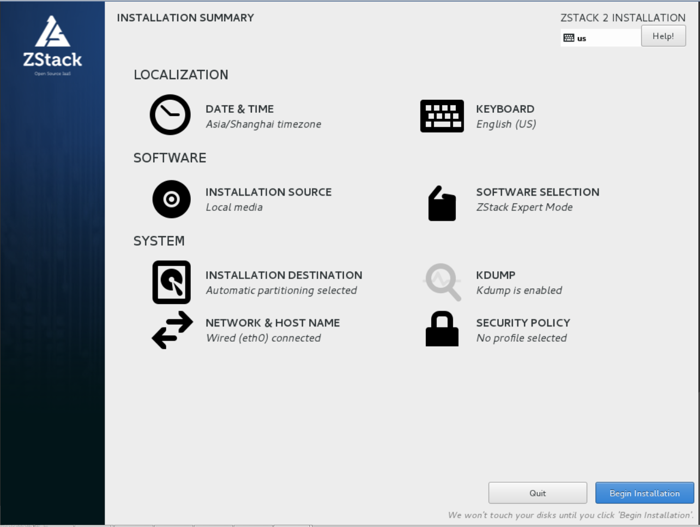
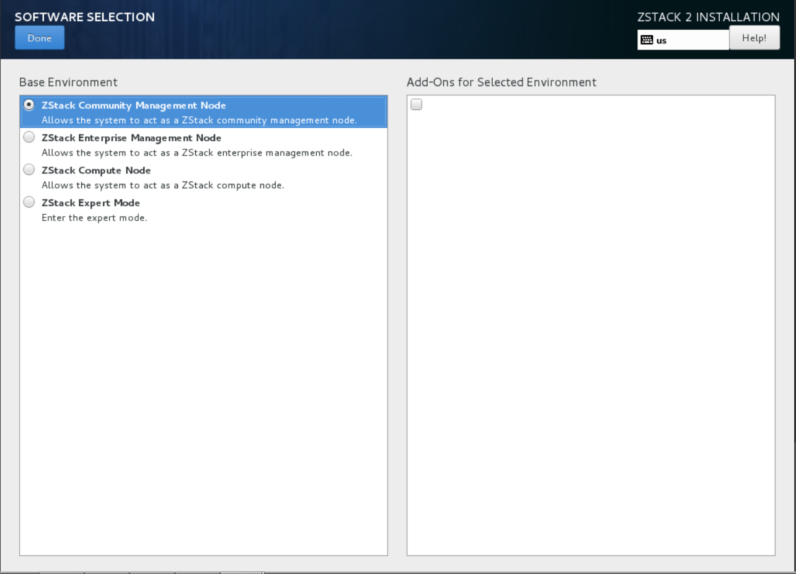
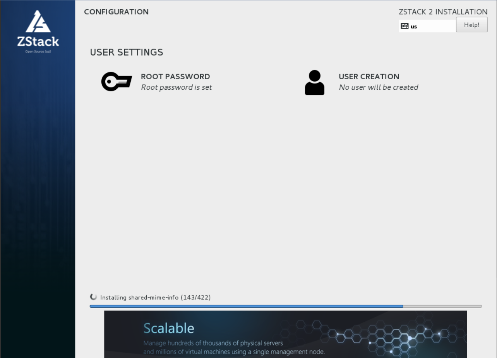

<h1 id="quickInstallation">Quick Installation</h1>

For users wanting to try out ZStack quickly, the best way is to install all software including KVM on a single machine so
you can build your first cloud with only one machine. Because of this, we recommend below hardware specification:

<table class="table table-striped table-bordered">
  <tr>
    <td><b>CPU</b></td>
    <td>>= 4 Cores Intel/AMD CPUs supporting VT-x or SVM</td>
  </tr>
  <tr>
    <td><b>Memory</b></td>
    <td>>= 8G</td>
  </tr>
  <tr>
    <td><b>Free Disk</b></td>
    <td>>= 250G</td>
  </tr>
  <tr>
    <td><b>OS</b></td>
    <td>ZStack customized ISO</td>
  </tr>
</table>

Installing ZStack must use the ZStack customized ISO and prepare the ZStack installation package.

  <h4>The Introduction of ZStack customized ISO</h4>
  <ul>
    <li>Based on CentOS-7-x86_64-Minimal-1511.ISO, friendly TUI management support a variety of system configuration.</li>
    <li>Install ZStack don't need to connect to the external network and configure yum source, you can achieve to install ZStack offline.</li>
    <li>Provide four installation modes: Enterprise management node mode, community management node mode, computing node mode, expert mode. The user can choose according to the demand. </li>
    <li>Cancel the eth setting. Using the system default NIC naming rules. </li>
  </ul>

#### The Introduction of Four Installation Modes
  
  <table class="table table-striped table-bordered">
    <tr>
      <td><b>ZStack Enterprise management node</b></td>
      <td>Install ZStack customized CentOS7.2 and ZStack Enterprise Management Node.</td>
    </tr>
    <tr>
      <td><b>ZStack Community Management Node</b></td>
      <td>Install ZStack customized CentOS7.2 and ZStack Community Management Node.</td>
    </tr>
    <tr>
      <td><b>ZStack Computer Node</b></td>
      <td>Install ZStack customized CentOS7.2 and the Compute Node essential package.</td>
    </tr>
    <tr>
      <td><b>ZStack Expert Node</b></td>
      <td>Install ZStack customized CentOS7.2 and config the local yum. The user can customize the system  application.</td>
    </tr>
  </table>

#### 1.Download ZStack ISO

ZStack user should download the ZStack customized ISO {{site.zstack_iso_name}}. 
 
#### Download link :
<ul>
  <li><b>ZStack ISO:</b>{{site.zstack_iso}}</li>
  <li><b>The md5sum of ZStack ISO</b>:{{site.zstack_iso_md5}}</li>
</ul>

#### 2. Burn ISO to USB:

In the hard drive list select the USB to burn.

  <h4>Precautions in using USB</h4>
  If the system is only inserted a USB, which is the default USB to burn and write. Before burning, please backup USB content.
  After the buring, the USB can be used as a boot disk.

#### 3.System Installation

The system has been pre-configured default options: DATE & TIME for the East Asia Area, LANGUAGE is English, KEYBOARD is English (US). The administrator can change the configuration.
  

  <h4>Mode selection</h4>
  If you want to <i>Quick install</i>,please choose <i>ZStack Community Management mode</i>.

Please be patient, the installation will cost a moment. You can click the <i>root password</i> to set the password.
Depending on the completeness of the distribution and the networking speed, the process may take 5 ~ 15 minutes.

The iso will install the machine with:

* Apache Tomcat 7 with zstack.war deployed
* ZStack web UI
* ZStack command line tool (zstack-cli)
* ZStack control tool (zstack-ctl)
* MySQL(will set MySQL root password, if it is empty.)
* RabbitMQ server
* NFS server
* Apache HTTP server

  <h4>If failed to install ZStack</h4>
  May be lack of NIC configuration or other causes lead to ZStack installation failure. The installation page will exit to the terminal. 
  For example: <i>If the server does not have available IP when installing ISO, the ZStack management node can't be installed properly.</i>
  

    <h4>After configuring the network, do the following command to install ZStack:</h4>
      <pre><code>bash /opt/zstack*installer.bin</code></pre>
  

  <h4>Default Credential</h4>

  The default credential for UI login is admin/password.

Now your ZStack is successfully installed, visit [Getting started with quick installation](../documentation/getstart-quick.html) see how to access web UI and command line tool.
