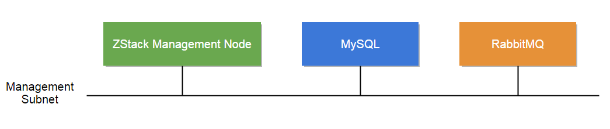

# Manual Installation

### 1. Install ZStack management node, MySQL and RabbitMQ on separate machines

For users wanting to setup a production ZStack environment, the recommended way is to install ZStack management node,
MySQL, and RabbitMQ message broker on separate machines:

For machine to install ZStack management node, we recommend below hardware specification:

<table class="table table-striped table-bordered">
  <tr>
    <td><b>CPU</b></td>
    <td>>= 4 Cores Intel/AMD CPUs supporting VT-x or SVM</td>
  </tr>
  <tr>
    <td><b>Memory</b></td>
    <td>
    
>= 4G

   

     <h4>The memory size depends on your environment</h4>
     The ZStack Java process consumes about 4G memory when serving 10,000 concurrent API requests. We recommend
     you to use a machine with at least 16G memory for a heavy workload production environment. For a proof of concept(POC)
     environment, smaller memory is OK.
   

    </td>
  </tr>
  <tr>
    <td><b>Free Disk</b></td>
    <td>
      
>= 250G

      

        <h4>A smaller disk is OK</h4>
        However, if you turn ZStack log level to DEBUG or TRACE, it will generate huge logs
        that can consume tens or hundreds of gigabytes disk.
      

    </td>
  </tr>
  <tr>
    <td><b>OS</b></td>
    <td>
      
CentOS6.x/CentOS7/Ubuntu14.04

      

        <h4>We have tested those OS</h4>
        Those OS have been tested while other Linux OS should work as well.
        We recommend you to use a fresh installed OS, to avoid unnecessary software conflicts. 
      

    </td>
  </tr>
</table>

For machines to install MySQL and RabbitMQ message broker, please refer to their official web sites.

  <h4>Low disk capacity can cause RabbitMQ hang</h4>
  Please make sure your RabbitMQ machine has enough memory and free disk.
  When encountering low memory or disk capacity, RabbitMQ will enter <i>flow control mode</i> which will throttle
  message delivery and lead to slow or paused ZStack management node.

#### 1.1 Install ZStack management node:

  <h4 class="hand" data-toggle="collapse" data-target="#china">Fast link for users of Mainland China (国内用户请点击展开)</h4>
  

      国内用户在访问我们美国服务器时速度较慢，请使用以下链接：
      
      <h4 style="margin-bottom:15px; margin-top:15px">Use <i>curl</i>:</h4>
      <pre><code>curl -L {{site.all_in_one_ch}} -o zstack-installer.bin
sudo bash zstack-installer.bin -i -R aliyun</code></pre>
      
      <h4 style="margin-bottom:15px">Use <i>wget</i>:</h4>
      <pre><code>wget -O zstack-installer.bin {{site.all_in_one_ch}}
sudo bash zstack-installer.bin -i -R aliyun</code></pre>
      
      在安装的过程中，脚本会从Linux发行商的repo里面安装需要的包。通过设置参数'-R aliyun'，ZStack会主动使用阿里云的yum镜像。用户也可以使用'-R 163'来指定163的yum镜像。
      如果用户是内网环境，有内部yum源，或是有特殊的yum源，请先设置好内部yum源（包括epel的源），然后在安装的时候不使用参数'-R aliyun'。
      如果使用Ubuntu的用户，最好也在安装前，把Ubuntu的apt-get的source list 预先配置速度最快的源。
      
      

        <h4>注意DNS劫持</h4>
        
        由于国内所有不能解析的域名都会被送到某DNS解析，造成在安装系统时随意设置的hostname也会被解析成IP，但该IP并不代表你本机。这会造成RabbitMQ在启动时出错，
        并可能导致登录MySQL时出错。我们的安装脚本会在安装时检测DNS劫持，如果发现错误解析的hostname会报错并停止安装。我们建议国内用户在安装前先检查你的hostname:
        
        <pre><code>ping `hostname`</code></pre>
        
        如果可以解析，但看到的IP不是127.x.x.x或者不是本机IP，则可能是DNS劫持，可以执行以下命令将hostname映射至本机：
        
        <pre><code>sudo echo "127.0.1.1 `hostname`" >> /etc/hosts</code></pre>
      

  

##### Use *curl*:

    curl -L {{site.all_in_one_en}} -o zstack-installer.bin
    sudo bash zstack-installer.bin -i
    
#### Use *wget*:

    wget -O zstack-installer.bin {{site.all_in_one_ch}}
    sudo bash zstack-installer.bin -i

The md5sum of ztack-installer.bin is:

{{site.all_in_one_md5}}

#### 1.2 Install MySQL

You can use ZStack control tool `zstack-ctl`, which is automatically installed along with ZStack in step 1.1,  to install
MySQL.

    sudo zstack-ctl install_db --host=ip_of_machine_to_install_mysql
    
    Example: sudo zstack-ctl install_db --host=192.168.0.224
    
`zstack-ctl` leverages [Ansible](http://www.ansible.com/home) to do the installation; it will ask you for SSH root password
if the SSH key is not set on the remote machine.

#### 1.3 Install RabbitMQ

You can use `zstack-ctl` to install RabbitMQ message broker:

    sudo zstack-ctl install_rabbitmq --host=ip_of_machine_to_install_mysql
    
    Example: sudo zstack-ctl install_rabbitmq --host=192.168.0.224
    

  <h4>The command will update zstack.properties</h4>
  After installing, <code>zstack-ctl</code> will automatically update IP of RabbitMQ to zstack.properties file.

#### 1.4 Install Web UI

You can use `zstack-ctl` to install web UI:

##### 1.4.1 Install to local

    sudo zstack-ctl install_ui
    
##### 1.4.2 Install to separate machine

    sudo zstack-ctl install_ui --host=ip_of_machine_to_install_ui
    
    Example: sudo zstack-ctl install_ui --host=192.168.0.224

Now your ZStack is successfully installed, visit [Getting Started With Manual Installation](../documentation/getstart-manual.html#manual) see how to configure and run ZStack. You can also
use above steps to install all software on a single machine.

  <h4>Default Credential</h4>
  
  The default credential for UI login is admin/password.

### 2. Full-manual Install 

For curious users who want to install ZStack without help from any script/tool, as ZStack is a standard Java WAR file, you
can follow below instructions.

  <h4>All below instructions use a single machine</h4>
  For the sake of demonstration, the instructions will install all software on a single machine.

#### 2.1. Install MySQL:

*CentOS6.x*

    sudo yum install mysql-server mysql
    
*CentOS7*

    sudo yum install mariadb mariadb-server
    
*Ubuntu14.04*

    sudo apt-get install mysql-server mysql-client
    
   
#### 2.2 Install RabbitMQ:

*CentOS6.6./7*

    sudo yum install rabbitmq-server
    

  <h4>You need to install EPEL repo</h4>
  For CentOS 6.x, you need to install [EPEL repo](http://fedoraproject.org/wiki/EPEL) first.

    
*Ubuntu14.04*

    sudo apt-get install rabbitmq-server
    
#### 2.3. Install Ansible:

*CentOS6.6./7*

    sudo yum install python-setuptools
    sudo easy_install pip
    sudo pip install ansible==1.7.2
    
*Ubuntu14.04*

    sudo apt-get install python-setuptools python-devel
    sudo easy_install pip
    sudo pip install ansible==1.7.2
    
> ***Note:** We specify Ansible version to 1.7.2 because it's the version we have tested. Later versions should work too.*

#### 2.4 Install Java:

ZStack requires JRE7 or later version.

*CentOS6.6/7*

    sudo yum install java-1.7.0-openjdk
    
*Ubuntu14.04*

    sudo apt-get install openjdk-7-jdk
    
#### 2.5. Install Tomcat:

As a standard Java WAR file, ZStack can be deployed in any Java web container; however, we recommend Tomcat because of its well-established
reputation. We recommend not to use the default Tomcat version shipped by Linux distributions, because they are usually old and contain modifications
that may cause troubles. You can download and install Tomcat from the official site by:

    wget http://archive.apache.org/dist/tomcat/tomcat-7/v7.0.35/bin/apache-tomcat-7.0.35.tar.gz
    tar xzf apache-tomcat-7.0.35.tar.gz
    

  <h4>We have tested Tomcat 7.0.35</h4>
  We specify Tomcat version to 7.0.35 only because it's the version we have tested. Any later Tomcat version should work fine as
  well. You can download them from [Tomcat Download Page](http://tomcat.apache.org/download-70.cgi).

    
#### 2.6. Install ZStack WAR:

Assuming your Tomcat `$CATALINA_HOME` is */usr/local/apache-tomcat*, you can download and install ZStack by:

    cd /usr/local/apache-tomcat/webapps
    wget {{site.war_en}}
    unzip zstack.war -d zstack
    
**In following sections, we assume the `$CATALINA_HOME` is */usr/local/apache-tomcat/*.**
    
#### 2.7. Install Control Tool:

    sudo sh /usr/local/zstack/apache-tomcat/webapps/zstack/WEB-INF/classes/tools/install.sh zstack-ctl
    
#### 2.8. Install Command Line Tool:

    sudo sh /usr/local/zstack/apache-tomcat/webapps/zstack/WEB-INF/classes/tools/install.sh zstack-cli
    
#### 2.0. Install Web UI:

You can install ZStack web UI by:

    sudo sh /usr/local/zstack/apache-tomcat/webapps/zstack/WEB-INF/classes/tools/install.sh zstack-dashboard

Now your ZStack environment is successfully installed, visit [Getting Started With Manual Installation](../documentation/getstart-manual.html#manual) see how to configure and run ZStack.
