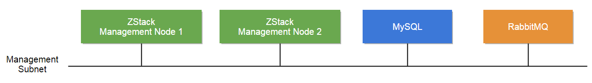

# Multi-node Installation

For users wanting to build a scaled out and high available production environment, ths recommended way is to 
install 2 ZStack management nodes, MySQL, and RabbitMQ on separate machines:

For machine to install ZStack management node, we recommend below hardware specification:

<table class="table table-striped table-bordered">
  <tr>
    <td><b>CPU</b></td>
    <td>>= 4 Cores Intel/AMD CPUs supporting VT-x or SVM</td>
  </tr>
  <tr>
    <td><b>Memory</b></td>
    <td>
    
>= 4G

   

     <h4>The memory size depends on your environment</h4>
     The ZStack Java process consumes about 4G memory when serving 10,000 concurrent API requests. We recommend
     you to use a machine with at least 16G memory for a heavy workload production environment. For a proof of concept(POC)
     environment, smaller memory is OK.
   

    </td>
  </tr>
  <tr>
    <td><b>Free Disk</b></td>
    <td>
          
>= 250G

      

        <h4>A smaller disk is OK</h4>
        However, if you turn ZStack log level to DEBUG or TRACE, it will generate huge logs
        that can consume tens or hundreds of gigabytes disk.
      

   </td>
  </tr>
  <tr>
    <td><b>OS</b></td>
    <td>
      
CentOS6.x/CentOS7/Ubuntu14.04

      

        <h4>We have tested those OS</h4>
        Those OS have been tested while other Linux OS should work as well.
        We recommend you to use a fresh installed OS, to avoid unnecessary software conflicts. 
      

    </td>
  </tr>
</table>

For machines to install MySQL and RabbitMQ message broker, please refer to their official web sites.

  <h4>Low disk capacity can cause RabbitMQ hang</h4>
  Please make sure your RabbitMQ machine has enough memory and free disk.
  When encountering low memory or disk capacity, RabbitMQ will enter <i>flow control mode</i> which will throttle
  message delivery and lead to slow or paused ZStack management node.

### 1. Install ZStack Management Node 1

  <h4 class="hand" data-toggle="collapse" data-target="#china">Fast link for users of Mainland China (国内用户请点击展开)</h4>
  

      国内用户在访问我们美国服务器以及<a href="https://pypi.python.org/pypi">Pypi</a>网站时速度较慢，请使用以下链接：
      
      <h4 style="margin-bottom:15px; margin-top:15px">Use <i>curl</i>:</h4>
      <pre><code>curl -L http://download.zstack.org/install.sh -o install-zstack.sh
sudo bash install-zstack.sh -a -R http://pypi.douban.com/simple/ -f http://7xi3lj.com1.z0.glb.clouddn.com/zstack-all-in-one-0.6.1.tgz</code></pre>
      
      <h4 style="margin-bottom:15px">Use <i>wget</i>:</h4>
      <pre><code>wget -O install-zstack.sh http://download.zstack.org/install.sh
sudo bash install-zstack.sh -a -R http://pypi.douban.com/simple/ -f http://7xi3lj.com1.z0.glb.clouddn.com/zstack-all-in-one-0.6.1.tgz</code></pre>
      
      在安装的过程中，脚本会从Linux发行商的repo里面安装需要的包。国内访问例如CentOS/RedHat/Ubuntu的repo通常会比较慢，如果你有常用的镜像repo，在执行脚本前
      先设置好镜像repo可以大大加快安装速度。
      
      
      

        <h4>注意DNS劫持</h4>
        
        由于国内所有不能解析的域名都会被送到某DNS解析，造成在安装系统时随意设置的hostname也会被解析成IP，但该IP并不代表你本机。这会造成RabbitMQ在启动时出错，
        并可能导致登录MySQL时出错。我们的安装脚本会在安装时检测DNS劫持，如果发现错误解析的hostname会报错并停止安装。我们建议国内用户在安装前先检查你的hostname:
        
        <pre><code>ping `hostname`</code></pre>
        
        如果可以解析，但看到的IP不是127.x.x.x或者不是本机IP，则可能是DNS劫持，可以执行以下命令将hostname映射至本机：
        
        <pre><code>sudo echo "127.0.1.1 `hostname`" >> /etc/hosts</code></pre>
      

  

#### Use *curl*:

    curl -L http://download.zstack.org/install.sh -o install-zstack.sh
    sudo bash install-zstack.sh -i
    
#### Use *wget*:

    wget -O install-zstack.sh http://download.zstack.org/install.sh 
    sudo bash install-zstack.sh -i
    

### 2. Install MySQL

You can use ZStack control tool `zstack-ctl`, which is automatically installed along with ZStack in step 1. To install
MySQL.

    sudo zstack-ctl install_db --host=ip_of_machine_to_install_mysql
    
    Example: sudo zstack-ctl install_db --host=192.168.0.225
    
`zstack-ctl` leverages [Ansible](http://www.ansible.com/home) to do the installation; it will ask you for SSH root password
if the SSH key is not set on the remote machine.

### 3. Install RabbitMQ

As step 2, you can use `zstack-ctl` to install RabbitMQ too:

    sudo zstack-ctl install_rabbitmq --host=ip_of_machine_to_install_mysql
    
    Example: sudo zstack-ctl install_rabbitmq --host=192.168.0.225
    

  <h4>The command will update zstack.properties</h4>
  After installing, <code>zstack-ctl</code> will automatically update IP of RabbitMQ to zstack.properties file.

### 4. Install ZStack Management Node 2

On the management node 1, you can use `zstack-ctl` to install extra management nodes:

    sudo zstack-ctl install_management_node --remote=ip_of_machine_to_install_node_2
    
    Example: sudo zstack-ctl install_management_node --remote=192.168.0.225
    
you can repeat this step to install more nodes if needed.
    
### 5. Install Web UI

On the management node 1, you can use `zstack-ctl` to install web UI:

#### 5.1 Install to local

    sudo zstack-ctl install_ui
    
#### 5.2 Install to separate machine

    sudo zstack-ctl install_ui --host=ip_of_machine_to_install_ui
    
    Example: sudo zstack-ctl install_ui --host=192.168.0.225
    
    

  <h4>Default Credential</h4>
  
  The default credential for UI login is admin/password.

    
Now your multi-node ZStack environment is successfully installed, visit [Getting Started With Multi-node Installation](../documentation/getstart-multi.html) see how to configure and run ZStack.

